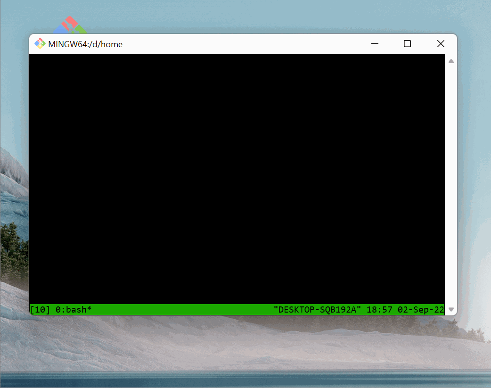

### 0. 前言

`Git for Windows`默认是不会安装`tmux`工具的，`tmux`对于开发者来说是特别方便的terminal工具，习惯了使用linux后，在windows上没有tmux使用特别不舒服。这边文章就是教你如何在windows上的`Git for Windows`中使用tmux。

`Git for Windows`是`MSYS2`的一个子集，并没有完全提供和MSYS2一样的环境。我们可以使用`MSYS2`预先编译好的binary来安装`tmux`。具体步骤如下:

### 1. 确认版本

需要确认你使用的git for windows 版本是最新版本 这样你就可以使用最新的`MSYS2`预编译的二进制包。

### 2. 下载以下包

* libevent [https://repo.msys2.org/msys/x86_64/libevent-2.1.12-2-x86_64.pkg.tar.zst](https://repo.msys2.org/msys/x86_64/libevent-2.1.12-2-x86_64.pkg.tar.zst)
* tmux [https://repo.msys2.org/msys/x86_64/tmux-3.3.a-1-x86_64.pkg.tar.zst](https://repo.msys2.org/msys/x86_64/tmux-3.3.a-1-x86_64.pkg.tar.zst)

解压以上的两个包

`zst`是一种压缩格式在linux环境中使用`tar --use-compress-program=unzstd -xvf tmux-3.3.a-1-x86_64.pkg.tar.zst`解压。Windows环境可以使用开源版本的[zstandard](https://github.com/facebook/zstd/releases/)解压[download](https://github.com/facebook/zstd/releases/download/v1.5.2/zstd-v1.5.2-win64.zip)。

### 3. 拷贝文件到git安装目录

1. [download_dir]/usr/bin  到 [gitforwindows]/usr/bin
2. [download_dir]/usr/share 到 [gitforwindows]/share

### 4. 测试

现在你可以在`git bash`环境中使用`tmux`了。

